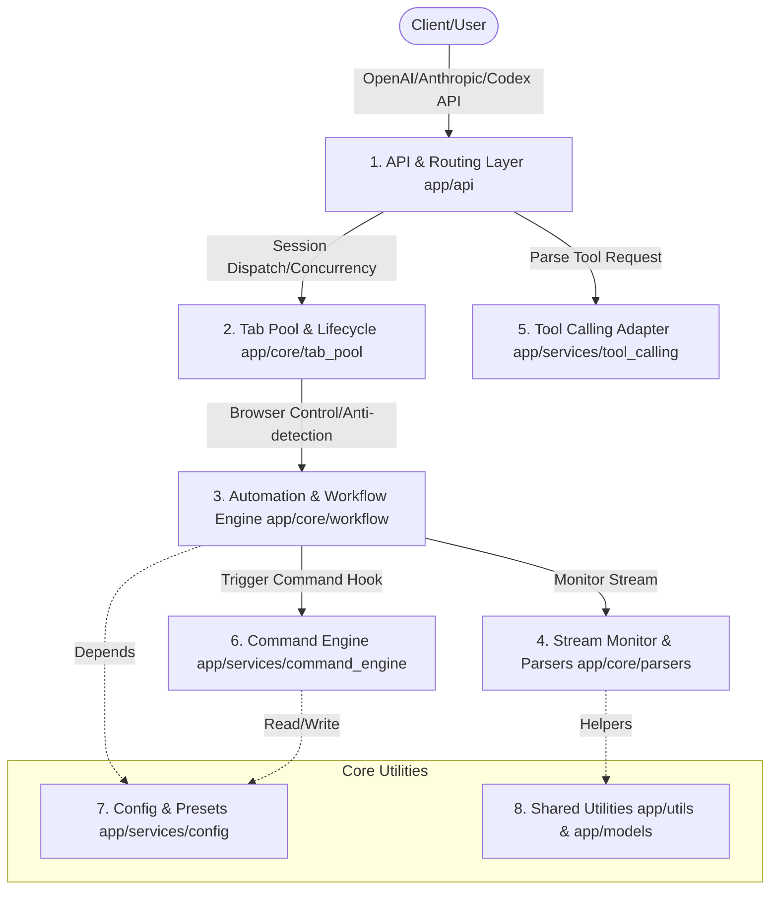

  

# Universal Web API

📖 Documentation • [English](./README.md) • [简体中文](./README.zh-CN.md)

**Universal Web API** is a **local API bridge & debugging tool** designed for developers. It converts AI web services (e.g., ChatGPT, DeepSeek, Claude, Gemini) logged in your local browser into local standard OpenAI/Anthropic-compatible APIs.

This project is dedicated to helping developers perform **workflow orchestration, client integration testing, and personal office automation locally**, ensuring data privacy and security without exposing API keys to third parties.

> ⚠️ **Compliance & Security Statement**: This tool runs entirely on the user's local system as a bridge helper. It **does not** provide any functionality to bypass authentication (login), crack security defenses (such as captcha solvers), or reverse-engineer encrypted APIs. Users must log into their own valid accounts in the controlled browser. Do not use this tool for high-frequency automated requests or commercial purposes.

---

## 📐 Project Architecture (Mermaid)

---

## 🌟 Highlights

*   **⚡ Zero-config Standard Compatibility**: Fully compatible with OpenAI standard API (including `/v1/chat/completions` and `/v1/models`) with experimental compatibility support for third-party developer tools (such as `/v1/messages` connectivity testing for Claude Code and `/v1/responses` endpoint for Codex plugins).
*   **🛠️ Local Controlled Browser Drive**: Lightweight automation of Chromium-based browsers (Chrome / Edge, etc.) using DrissionPage. All data stays local for end-to-end privacy.
*   **🛡️ Human-like Interaction**: Built-in keyboard keypress simulations, focus emulation, and mouse path movements to minimize account detection.
*   **📦 Intelligent Tab Pooling**: Multi-tab concurrency with default, domain, fixed-tab, exact-URL, and URL-bound preset routes, plus first-idle, round-robin, and random allocation modes.
*   **📡 Dual-channel Stream Parsing**: Combined CDP network interception and DOM mutation monitoring to stream increments in real-time, regardless of the site's rendering technique.
*   **📎 Multimodal & Attachment Self-healing**:
    *   Extract and download text, images, audio, and video content locally from web sessions.
    *   Oversized prompts are automatically staged as local temporary files for upload (for sites that handle file-style inputs better).
*   **🧩 Robust Tool Calling**: Injects schema verification feedback loops into web sessions. If a web model produces invalid arguments, it automatically triggers local correction prompts, boosting tool-calling reliability.

---

## 🚀 Quick Start

### Prerequisites
1. OS: Windows (Fully supported) / macOS or Linux (Core features supported)
2. Requirements: **Python 3.10+** and a Chromium-based browser (Chrome, Edge, or Brave) installed.

### Setup Steps

1. **Download & Extract**: Download the latest release from [Releases](../../releases) and extract it to a path **without non-ASCII (e.g. Chinese) characters**.
2. **Start the Service**:
   * **Windows**: Double-click **`start.bat`**.
   * **macOS / Linux**: Run **`python3 start.py`** in your terminal.
3. **Initialization**: Once dependencies are validated and installed, a controlled browser window will pop up automatically, and the console will open in a normal browser at `http://127.0.0.1:8199`. Keep AI websites in the controlled browser, and use your normal browser for the dashboard and tutorial.
4. **Log In**: In the controlled browser, log in to your own AI web accounts (e.g., chatgpt.com, claude.ai), then keep the target site on a real chat-ready page.
5. **Configure Clients**: In any client, set the API configurations:
   * **Base URL**: `http://127.0.0.1:8199/v1`
   * **API Key**: If auth token verification is disabled, use any value (e.g., `sk-local`). If enabled, use your custom configured token.

---

## 🎯 Supported Sites

Built-in automation rules are available for several mainstream AI websites. For unlisted sites, you can use the built-in AI assistant to analyze page DOM structures and generate adaptations. See [Add a New Site Guide](./static/tutorial/index.html#add-site-guide).

| Site Name | URL | Notes |
| :--- | :--- | :--- |
| **ChatGPT** | chatgpt.com | Supports extremely long prompts via file uploads |
| **DeepSeek** | chat.deepseek.com | Adapted for reasoning/thinking stream output extraction |
| **Gemini** | gemini.google.com | Excellent for testing local multimodal workflows |
| **Claude** | claude.ai | Comprehensive page interaction and attachment handling |
| **Kimi** | www.kimi.com | Excellent long-context file-paste support |
| **Qwen** | chat.qwen.ai | DOM rules adapted for domestic LLM web automation |
| **Grok** | grok.com | Decodes native websocket/HTTP stream response data |
| **Doubao** | www.doubao.com | Fully adapted for the latest page structures |
| **AI Studio** | aistudio.google.com | High-throughput developers testing environment |
| **Arena AI** | arena.ai | Comparative debugging (sensitive to IP quality) |

---

## 📖 Documentation

Detailed HTML guides are hosted locally and can be accessed via the dashboard after launch:

| Section | Description |
| :--- | :--- |
| 📖 [Full Tutorial](./static/tutorial/index.html#quick-start) | Installation, platform differences, and UI dashboard guides |
| 🔗 [Connect API](./static/tutorial/index.html#connect-api) | Request parameters, routing modes (Default, Domain, Fixed Tab, Exact URL, URL-bound Preset), and code examples |
| 🧩 [Function Calling](./static/tutorial/index.html#function-calling) | Validation repair strategy and multi-turn prompt engineering explanations |
| 🔄 [Tab Pool and Presets](./static/tutorial/index.html#tab-pool) | Configuring concurrency, route methods, allocation modes, and custom task presets |
| 📊 [Request Monitor](./static/tutorial/index.html#dashboard-advanced) | Inspect request history, failure details, per-site success rates, and debug stuck tasks |
| 🛠️ [Core Selector Configuration](./static/tutorial/index.html#selectors) | CSS selector mapping, visual workflows, and streaming options |
| 🛡️ [Stealth & Advanced Options](./static/tutorial/index.html#stealth-mode) | Anti-detection settings, browser fingerprint overrides, and low-interference modes |
| ❓ [Limitations & FAQ](./static/tutorial/index.html#faq) | Timeout troubleshooting, captcha handling, and OS differences |

---

## 🤝 Feedback & Discussion

* If you run into issues, join the QQ Group **1073037753**.
* You can also open issues or suggest features in the GitHub [Issues](../../issues) tracker.

---

## ⚖️ Disclaimer

1. **Purpose**: This project is intended solely for personal technical research, educational demonstration, and testing. Do not deploy it in production environments or use it for commercial profit-making activities.
2. **Compliance**: Before using this software, read and comply with the target sites' Terms of Service. Users are solely responsible for account limitations, suspensions, or disputes arising from using this automation tool.
3. **No Hacking**: This software does not engage in network intrusion, cracking, reverse engineering of APIs, or bypassing payment walls. All interactions are achieved by automating actions in a legitimate browser owned and logged in by the user.
4. **Liability**: The maintainers assume no liability for any direct or indirect damage or loss (including account bans, business losses, or data loss) resulting from using this software.

---

## 📄 License

This project is licensed under the [AGPL-3.0](./LICENSE).
