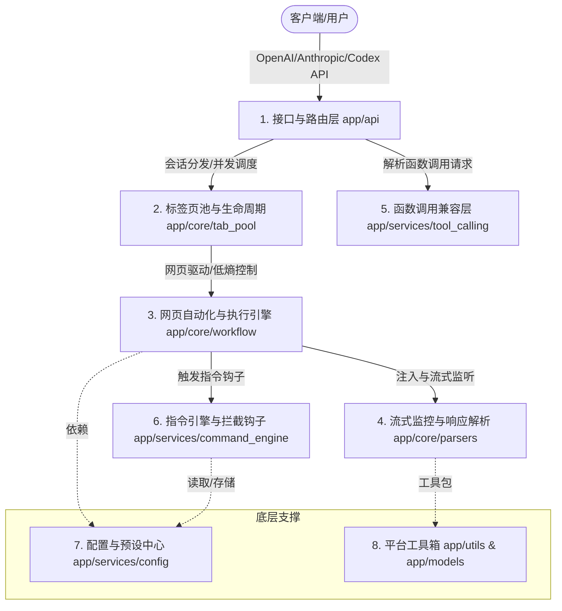

  

# Universal Web API

📖 文档 • [English](./README.md) • [简体中文](./README.zh-CN.md)

**Universal Web API** 是一个专为开发者设计的**本地 API 桥接调试工具**。它能够将您在本地浏览器中已登录并正常使用的 AI 网页端服务（如 ChatGPT, DeepSeek, Claude, Gemini 等）转换为本地标准的 OpenAI/Anthropic 兼容接口。

该项目致力于帮助个人开发者在本地进行**工作流编排、客户端集成测试与个人办公自动化**，无需将 API 密钥暴露给第三方，确保数据隐私与网络安全。

> ⚠️ **合规与安全申明**：本工具仅作为一个本地自动化辅助桥接器，在用户本地系统运行。它**不具备且不提供**任何绕过目标网站身份验证（登录）、破解安全机制（如人机验证）或逆向解密接口的功能。用户需自行在受控浏览器中登录合法账号。请勿将本工具用于高频自动化请求或任何商业用途。

---

## 📐 项目架构设计 (Mermaid 拓扑)

---

## 🌟 项目亮点

*   **⚡ 零配置、标准兼容**：提供标准 OpenAI 兼容（包括 `/v1/chat/completions` 与 `/v1/models`），并提供面向 Claude Code/Codex 等第三方编程工具的实验性兼容接入（如针对 Claude Code 的 `/v1/messages` 连通性测试，以及针对 Codex 插件的 `/v1/responses` 专用端点）。
*   **🛠️ 本地受控浏览器驱动**：基于 DrissionPage 库对本地 Chromium 内核浏览器（Chrome / Edge 等）进行轻量自动化控制，数据完全留存在本地，端到端隐私安全。
*   **🛡️ 拟人化安全调试**：内置平滑按键模拟、焦点仿真以及人鼠交互模拟，尽量降低因异常自动化检测导致的账号干扰。
*   **📦 智能标签页池调度**：内置标签页池（Tab Pool），支持默认分配、站点域名、固定标签页、精确 URL 与 URL 绑定预设路由，并提供优先空闲、轮询、随机等分配模式。
*   **📡 双通道流式解析**：结合网络层响应侦听（CDP Interception）与 DOM 增量分析双通道技术，无论网页端采用何种渲染方式，都能秒级同步输出 SSE 流式内容。
*   **📎 多模态与超长附件自愈**：
    *   自动提取并本地下载网页端的文字、图片、音频、视频内容。
    *   针对超长提示词，支持自动封装为本地临时文件进行上传（适合更偏好附件交互的网站）。
*   **🧩 智能函数调用自愈 (Tool Calling)**：在网页交互中注入参数校验反馈机制，如果模型输出的 JSON 参数校验失败，可自动发起本地回盘自愈，提高函数调用成功率。

---

## 🚀 快速开始

### 前提条件
1. 操作系统：Windows (完美支持) / macOS 或 Linux (支持基本功能)
2. 环境要求：**Python 3.10+** 且系统已安装 Chrome / Edge / Brave 等 Chromium 内核浏览器

### 安装启动步骤

1. **下载解压**：从 [Releases](../../releases) 下载最新压缩包，并解压到**无中文路径**的本地目录。
2. **一键启动**：
   * **Windows**：双击运行根目录下的 **`start.bat`**。
   * **macOS / Linux**：在终端执行 **`python3 start.py`**。
3. **完成初始化**：等待依赖包自动校验安装完成后，系统会自动弹出一个受控的浏览器窗口，并在普通浏览器中打开本地控制台 `http://127.0.0.1:8199`。受控浏览器只建议放 AI 站点，控制台和教程请在普通浏览器里查看。
4. **账号登录**：在受控浏览器窗口中，登录您拥有的 AI 网站账号（如 ChatGPT、DeepSeek 等），并保持目标站点停留在可对话页面。
5. **客户端配置**：在您的任意 AI 客户端（如翻译插件、Chat UI）中修改 API 配置：
   * **API 地址 (Base URL)**：`http://127.0.0.1:8199/v1`
   * **API Key**：若未在 `.env` 中启用授权认证，可填任意值（如 `sk-local`）；若启用了配置中的密钥验证，请填写对应的自定义 Token。

---

## 🎯 已适配站点列表

系统已内置多款主流 AI 站点的自动化交互规则。对于未收录的网站，控制台还支持通过 AI 自动分析网页 DOM 结构进行适配，详情请参阅 [新增站点指南](./static/tutorial/index.html#add-site-guide)。

| 站点名称 | 官方网址 | 备注 |
| :--- | :--- | :--- |
| **ChatGPT** | chatgpt.com | 单次发送支持超长上下文 |
| **DeepSeek** | chat.deepseek.com | 已适配其深度思考 (Thinking) 流式提取 |
| **Gemini** | gemini.google.com | 适合本地多模态数据交互测试 |
| **Claude** | claude.ai | 支持完备的页面交互与附件上传 |
| **Kimi** | www.kimi.com | 支持长上下文附件粘贴模式 |
| **通义千问** | chat.qwen.ai | 国产大模型网页自动化测试 |
| **Grok** | grok.com | 支持网页原生交互流解析 |
| **豆包** | www.doubao.com | 完美适配最新版页面结构 |
| **AI Studio** | aistudio.google.com | 适合开发者高吞吐测试 |
| **Arena AI** | arena.ai | 用于盲测对比调试（对网络 IP 纯净度要求较高） |

---

## 📖 开发者文档

为了让您能够更好地自定义工作流与路由，我们准备了详细的本地 HTML 文档（可在服务启动后通过控制台访问）：

| 文档章节 | 描述说明 |
| :--- | :--- |
| 📖 [完整使用文档](./static/tutorial/index.html#quick-start) | 包含详细的安装说明、运行机制与各操作系统支持度 |
| 🔗 [连接 API 指南](./static/tutorial/index.html#connect-api) | 请求路由规则解释（默认、域名、固定标签页、精确 URL、URL 绑定预设）与调用代码示例 |
| 🧩 [智能函数调用](./static/tutorial/index.html#function-calling) | 本地 Function Calling 的多轮纠错与自愈策略说明 |
| 🔄 [标签页池与预设](./static/tutorial/index.html#tab-pool) | 如何配置多标签并发、路由方式、分配模式与预设（Presets） |
| 📊 [请求监控与排障](./static/tutorial/index.html#dashboard-advanced) | 查看请求历史、失败详情、分站点成功率，并使用调试接口取消或释放卡住的任务 |
| 🛠️ [核心选择器与配置](./static/tutorial/index.html#selectors) | CSS 选择器编写、可视化步骤定义、流式参数解释 |
| 🛡️ [低干扰与高级环境](./static/tutorial/index.html#stealth-mode) | 浏览器指纹防护、低熵行为模拟等抗检测配置 |
| ❓ [常见问题与限制说明](./static/tutorial/index.html#faq) | 超时排查、验证码处理指导、平台差异性说明 |

---

## 🤝 交流反馈

* 遇到启动或适配问题，欢迎加 QQ 交流群 **1073037753** 寻求帮助。
* 也可以在项目 [Issues](../../issues) 提交反馈或特性建议。

---

## ⚖️ 免责声明 (Disclaimer)

1. **用途限制**：本项目仅限个人用于技术研究、学术探讨、开发调试及日常办公提效。请勿将其用于生产环境或任何商业牟利活动。
2. **合规使用**：使用本软件前，请务必仔细阅读并遵守各目标 AI 网站的《服务条款》和《使用协议》。使用者因使用本软件违反服务协议而产生的账号受限、封禁或其它争议，均由使用者本人承担。
3. **技术定位**：本软件不涉及任何针对目标网站的网络入侵、破解安全屏障、API 逆向工程或绕过付费限制的行为。所有功能均基于合法的本地浏览器自动化（即模拟用户屏幕操作），且完全开源可查。
4. **免责保证**：项目维护者不对因使用本软件造成的任何直接或间接损失（包括但不限于账号损失、商业利润损失或数据丢失）承担任何责任。

---

## 📄 开源许可证

本项目基于 [AGPL-3.0](./LICENSE) 协议开源。
